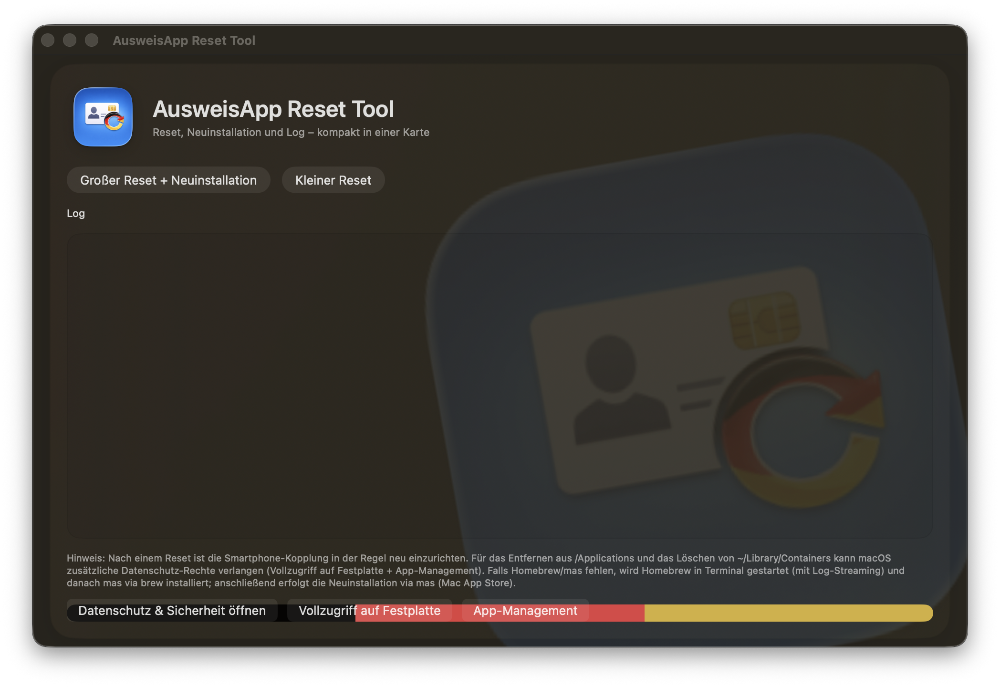

# AusweisApp Reset Tool (macOS)

Kleines macOS-Tool (SwiftUI) zum **Zurücksetzen** der AusweisApp (User-Daten/Container) sowie optional zum **Neuinstallieren** via Mac App Store (`mas`).

## Funktionen

- **Großer Reset + Neuinstallation**
  - Beendet die AusweisApp
  - Löscht relevante User-Daten (Container/Prefs/Caches – eng gefasst)
  - Entfernt die App aus `/Applications` (ggf. mit Admin-Prompt)
  - Installiert anschließend per `mas install` neu
  - Startet die App wieder

- **Kleiner Reset**
  - Beendet die AusweisApp
  - Löscht relevante User-Daten (Container/Prefs/Caches – eng gefasst)
  - Startet die App wieder

## Voraussetzungen

- macOS
- Für **Neuinstallation**:
  - Homebrew (falls nicht vorhanden, kann das Tool die Installation im Terminal anstoßen)
  - `mas` (wird bei Bedarf via `brew install mas` installiert)
  - Du musst im **Mac App Store** angemeldet sein (für `mas install`).

## Wichtige macOS-Berechtigungen (TCC)

Damit das Tool zuverlässig löschen kann (insbesondere:
`~/Library/Containers/...` und `/Applications/...`), braucht es in macOS Privacy/TCC in der Regel:

- **Vollzugriff auf Festplatte**
- **App-Management** (für Entfernen/Verwalten von Apps in `/Applications`)

Pfad:
**Systemeinstellungen → Datenschutz & Sicherheit → Vollzugriff auf Festplatte**  
**Systemeinstellungen → Datenschutz & Sicherheit → App-Management**

Wichtig:
- Wenn du das Tool **aus Xcode** startest, gelten TCC-Rechte oft für den *Runner/Debug-Prozess*.
- Für stabile Rechte: die **exportierte/standalone App** (Release/Archive/Export) autorisieren.

## Bedienung

1. Tool starten
2. Button **„Großer Reset + Neuinstallation“** oder **„Kleiner Reset“** drücken
3. Eventuelle macOS-Prompts (Admin/TCC) bestätigen
4. Bei „Neuinstallation“ wird `mas` im Terminal ausgeführt; nach Abschluss installiert und startet die AusweisApp wieder.

## Zielpfade (eng gefasst)

Das Tool entfernt ausschließlich typische, app-bezogene Pfade, u. a.:

- `~/Library/Containers/<bundleId>`
- `~/Library/Preferences/<bundleId>.plist`
- `~/Library/Caches/<bundleId>`
- `~/Library/Saved Application State/<bundleId>.savedState`

## Hinweise / Troubleshooting

- Wenn im Log **„Operation not permitted“** auftaucht:
  - Vollzugriff auf Festplatte und App-Management prüfen
  - Tool komplett beenden und neu starten (TCC greift teils erst dann)
- Nach einem Reset muss die Smartphone-Kopplung in der AusweisApp häufig neu eingerichtet werden.

## Lizenz

Private/Interne Nutzung (bis eine Lizenz ergänzt wird).
## Screenshot

